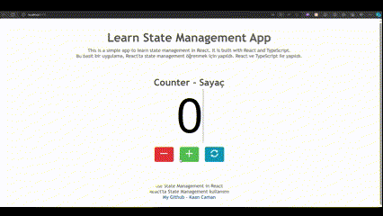
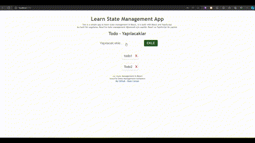

# 4. State Yönetimi / State Management

## React + TypeScript + Vite

Bu bölümde, React uygulamalarında state yönetimi için `useState` ve kavramnı öğreneceğiz.

## useState

`useState` fonksiyonu, React uygulamalarında state yönetimi için kullanılır. Bu fonksiyon, bir state değişkeni ve bu değişkeni güncellemek için bir fonksiyon döndürür.

```tsx
import React, { useState } from 'react';

function Counter() {
  const [count, setCount] = useState(0);

  return (
    <div>
      <p>You clicked {count} times</p>
      <button onClick= {() => setCount(count + 1)}>
        Click me
      </button>
    </div>
  );
}

```

Yukarıdaki örnekte, `useState` fonksiyonu ile `count` adında bir state değişkeni ve bu değişkeni güncellemek için `setCount` adında bir fonksiyon oluşturduk. Bu fonksiyonu butona tıkladığımızda çağırarak, state değişkenimizi güncelledik.

### Kullanım Alanları

`useState` fonksiyonu, React uygulamalarında state yönetimi için kullanılır. Bu fonksiyon, fonksiyonel componentlerde state yönetimi yapmamızı sağlar.

### Örnekler

- [Counter](./src/examples/counter/counter.tsx)
    <!-- gif image -->
    

- [Todo List](./src/examples/todo/todo.tsx)
    <!-- gif image -->
    

<!-- english -->

## useStates

In this section, we will learn about `useState` and state management in React applications.

The `useState` function is used for state management in React applications. This function returns a state variable and a function to update this variable.

```tsx

import React, { useState } from 'react';

function Counter() {
  const [count, setCount] = useState(0);

  return (
    <div>
      <p>You clicked {count} times</p>
      <button onClick= {() => setCount(count + 1)}>
        Click me
      </button>
    </div>
  );
}

```

In the example above, we created a state variable called `count` and a function called `setCount` to update this variable using the `useState` function. We updated the state variable by calling this function when we clicked the button.

### Use Cases

The `useState` function is used for state management in React applications. It allows us to manage state in functional components.

### Examples

- [Counter](./src/examples/counter/counter.tsx)
    <!-- gif image -->
    
- [Todo List](./src/examples/todo/todo.tsx)
    <!-- gif image -->
    
