# 5.  Rotalama ve işlemleri / Routing and Operation

## React + TypeScript + Vite

### Basit Bir useEffect hooku Kullanımı / Basic Use of useEffect hook

- [BasicUseEffect.tsx](./src/components/BasicUseEffect.tsx)

```tsx
import { useState, useEffect } from "react";

// Basit bir useEffect kullanımı
// Basic use of useEffect
const BasicUseEffect = () => {
  // state tanımla
  // define state
  const [state, setState] = useState("First value for state");

  // state değiştiğinde useEffect çalışacak
  // useEffect will run when state changes
  useEffect(() => {
    console.log("useEffect called");
    setTimeout(() => {
      setState("Second value for state");
    }, 4000);
  }, [state]);

  // return içerisinde state'i göster
  // show state in the return
  return (
    <>
      <h1>Basic UseEffect</h1>
      <p>state 4 saniye sonra değişecek ve useEffect çalışacak</p>
      <p>state will change after 4 seconds and useEffect will run </p>

      <h2>{state}</h2>
    </>
  );
};
```

### react-router-dom ile sayfa yönlendirme / Page routing with react-router-dom

- [reactrouter.com/en/main/start/tutorial](https://reactrouter.com/en/main/start/tutorial)
- [şu](https://reactrouter.com/en/main/start/tutorial) likteki adımları takip ederek react-router-dom kullanımını öğrenebilirsiniz.

- You can learn how to use react-router-dom by following the steps in [this](https://reactrouter.com/en/main/start/tutorial) link.

#### Ekran Görüntüsü / Screenshot

<!-- add image -->

- Anasayfa / index
 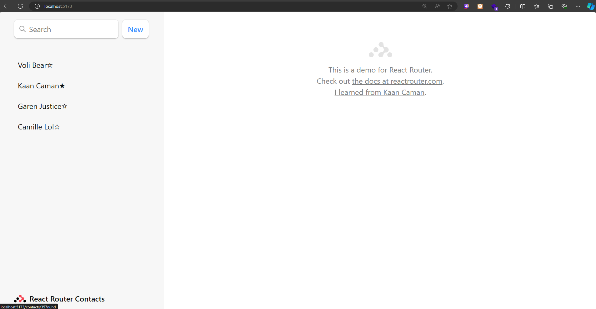

- Kişi Detayı / Contact Detail
  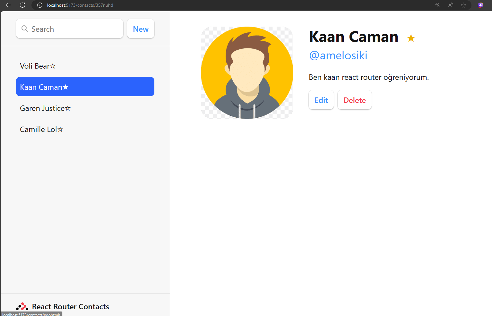

- Kişi Ekle / Add Contact
  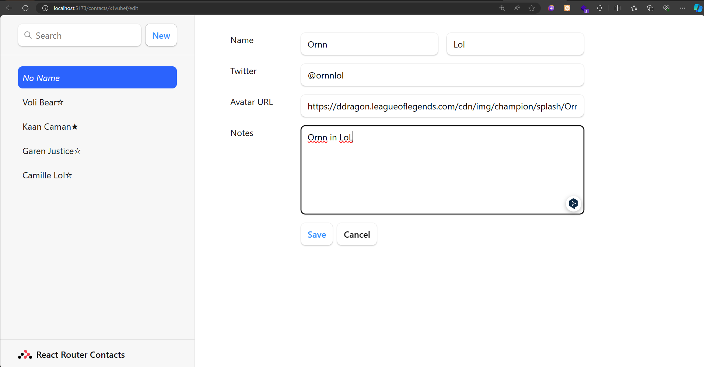

- Kişi Listesi / Contact List
  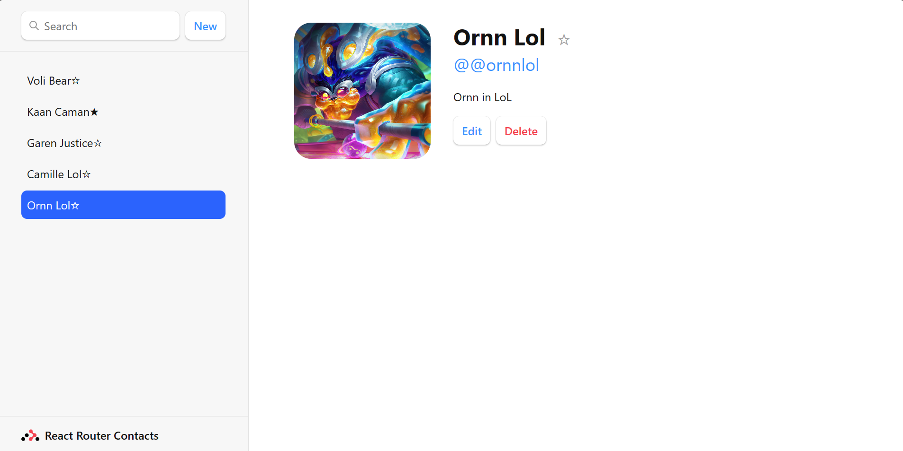

- Kişi Düzenle / Edit Contact
  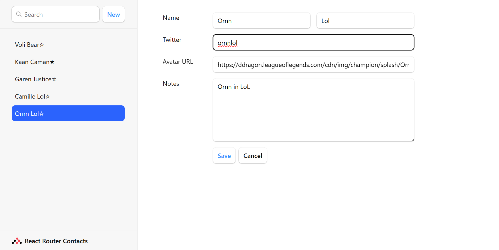
  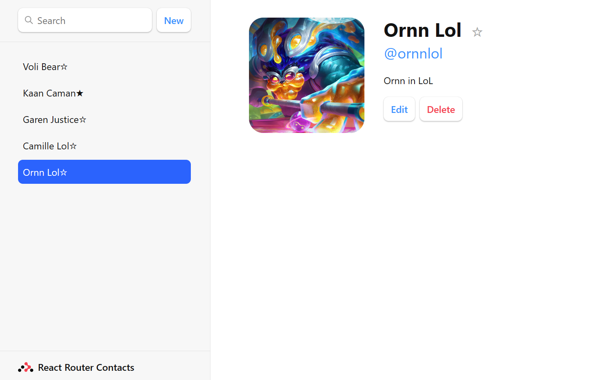

- Favoriye Ekleme - Cıkarma / Add/Remove to Favorite
  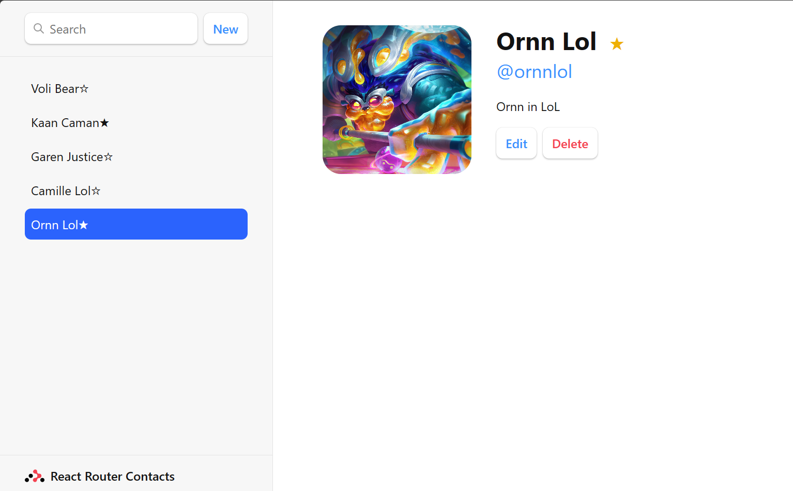
  

- Kişi Silme / Delete Contact
  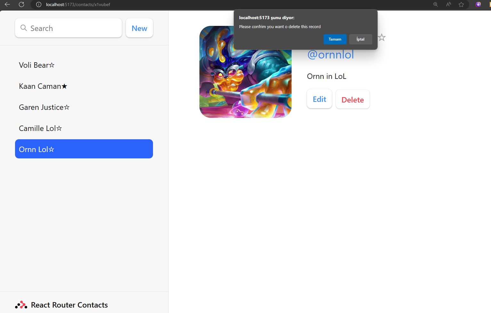
  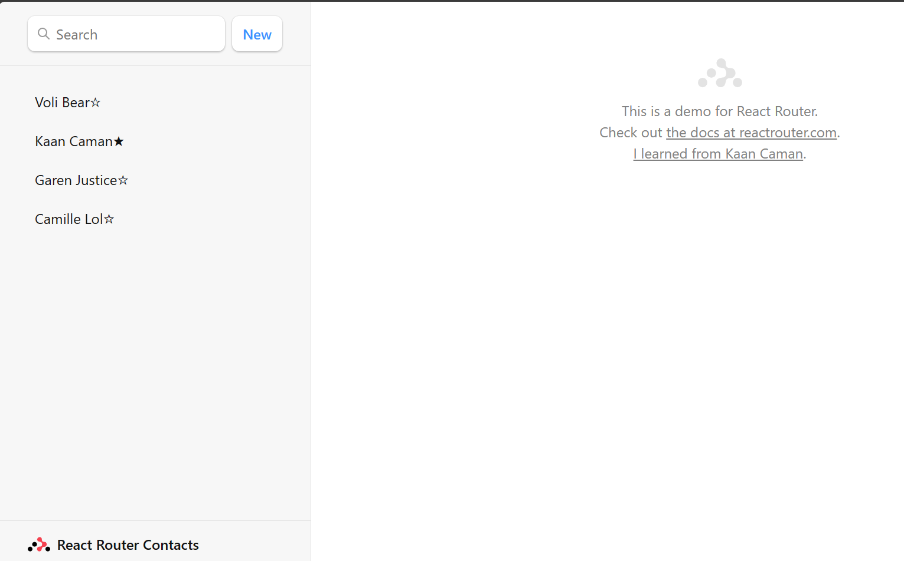

- Search
  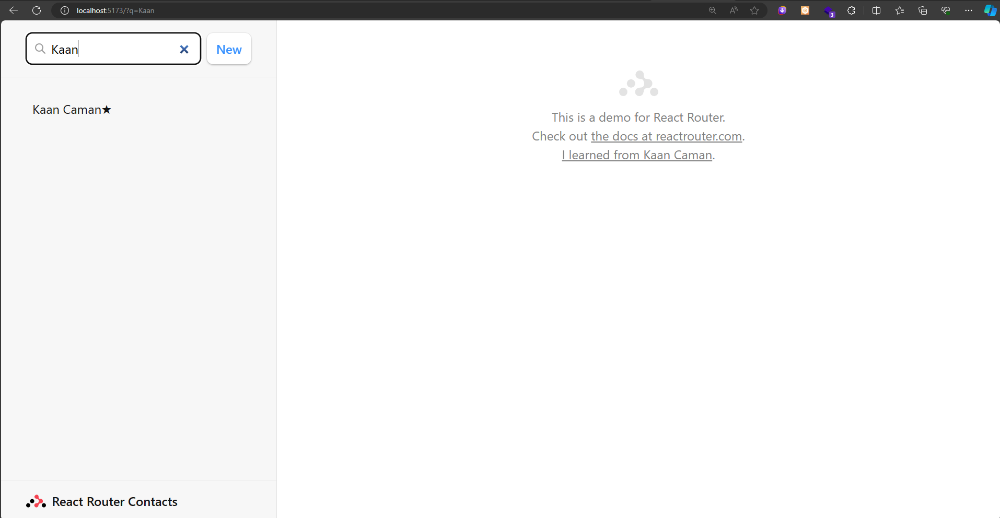
  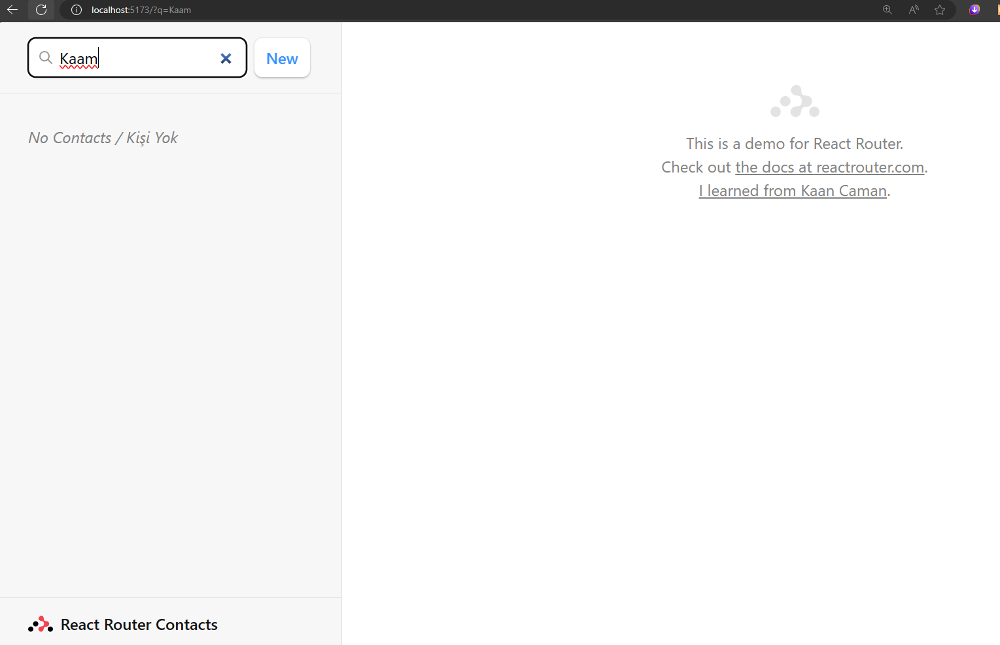

- 404
  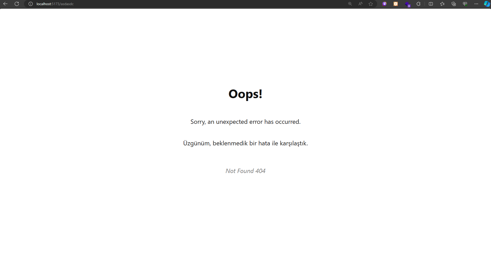
